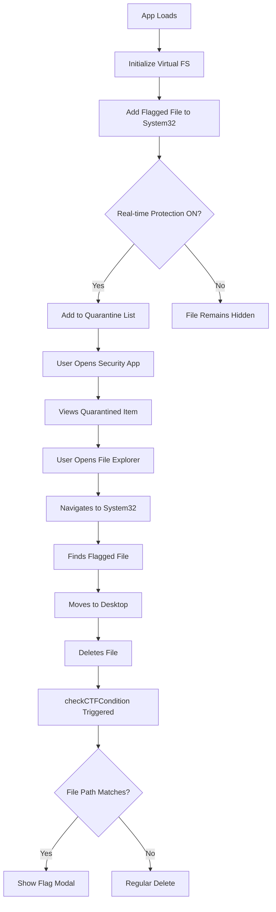

# Windows 11 CTF Training Environment

A browser-based Windows 11 simulation designed for cybersecurity training and Capture The Flag (CTF) challenges. This project provides a safe, sandboxed environment where users can practice identifying and removing security threats without risk to real systems.

## 🎯 CTF Challenge

**Objective:** Find and eliminate a hidden malicious file from the system to capture the flag.

### Player Instructions

1. **Launch the Environment**: Open the application in your browser
2. **Explore the System**: Navigate through the simulated Windows 11 interface
3. **Check Security**: Open Windows Security to view detected threats
4. **Investigate Files**: Use File Explorer to browse system folders
5. **Find the Threat**: Locate the flagged file (hint: check C:\Windows\System32\)
6. **Eliminate**: Delete the malicious file from the Desktop to reveal the flag

**Two ways to win:**
- Move the flagged file from System32 to Desktop, then delete it
- Delete the flagged file directly while viewing it in the file explorer

## 🛡️ Safety & Ethics

**IMPORTANT:** This application is designed solely for educational and training purposes:

- **No Real Malware**: The "flagged file" is a harmless text file used only for the CTF puzzle
- **Browser Sandboxed**: All operations occur within the browser's storage (IndexedDB)
- **No System Access**: The app never accesses your real file system, runs system commands, or downloads binaries
- **Safe to Use**: Your actual computer remains completely unaffected

## 🚀 Quick Start

### Prerequisites
- Node.js (v16 or higher)
- npm or yarn

### Installation

```bash
# Clone the repository
git clone <repository-url>
cd <project-directory>

# Install dependencies
npm install

# Start development server
npm run dev
```

The application will be available at `http://localhost:8080`

### Build for Production

```bash
npm run build
```

The production build will be in the `dist` folder.

## 🎮 Features

### Desktop UI
- Windows 11-inspired interface with taskbar and start menu
- Draggable and resizable windows
- Desktop icons and file management

### Virtual File System
- In-browser persistence using IndexedDB
- Simulated folder structure: C:\Windows\System32\, C:\Users\Default\, etc.
- Create, rename, edit, and delete files and folders
- File metadata tracking (size, dates, type)

### Windows Security App
- Real-time protection toggle
- Cloud protection and firewall settings
- Quarantine management
- Threat detection logs

### Working Applications
- **File Explorer**: Navigate and manage files
- **Paint**: Create and edit images with drawing tools
- **Calculator**: Functional calculator with basic operations
- **Notepad**: Text editor for viewing/editing files

### CTF Mechanics
- Pre-populated fake system files in System32
- One flagged "malicious" file hidden among legitimate-looking files
- Automatic detection and quarantine simulation
- Flag reveal upon successful threat elimination

## ⚙️ Configuration

### Customizing the CTF Challenge

Edit `ctf-config.json` in the project root:

```json
{
  "flaggedFile": {
    "name": "system_helper.dll",
    "path": "C:/Windows/System32/system_helper.dll",
    "threatLevel": "High",
    "detectionReason": "Suspicious behavior detected"
  },
  "flag": "ctf7{linux_is_always_better}",
  "security": {
    "realtimeProtectionEnabled": true,
    "cloudProtectionEnabled": true,
    "firewallEnabled": true
  }
}
```

**Configuration Options:**
- `flaggedFile.name`: The filename of the malicious file
- `flaggedFile.path`: Where the file is located in the virtual file system
- `flag`: The CTF flag string shown when the challenge is completed
- `security.*`: Default security settings on app load

### For Admins

To create custom challenges:
1. Modify the flagged file name and path in `src/lib/ctfConfig.ts`
2. Change the flag string to your custom flag
3. Adjust the threat level and detection reason
4. Rebuild the application

## 🏗️ Architecture

### Technology Stack
- **Frontend**: React 18 + TypeScript
- **Build Tool**: Vite
- **Styling**: Tailwind CSS
- **State Management**: React Context API
- **Storage**: IndexedDB (via `idb` library)
- **UI Components**: shadcn/ui + Radix UI

### Key Modules

- **Virtual File System** (`src/lib/virtualFS.ts`): Manages all file operations
- **Desktop Context** (`src/contexts/DesktopContext.tsx`): Global state for windows, security settings, and CTF logic
- **Window Manager** (`src/components/Window.tsx`): Handles window dragging, resizing, and focus
- **Apps** (`src/components/apps/`): Individual application implementations

### CTF Logic Flow



## 🧪 Testing

Run the test suite:

```bash
npm test
```

The tests verify:
- CTF condition triggers correctly when the flagged file is deleted
- Other file deletions don't trigger the flag
- Virtual file system operations work as expected

## 📝 Development Guidelines

### Adding New Features

1. **New Apps**: Create a new component in `src/components/apps/`
2. **File Types**: Extend the MIME type handling in FileExplorer and Desktop components
3. **System Files**: Modify the `initializeDefaultFS()` method in `virtualFS.ts`

### Design System

All colors and styles follow the design system defined in:
- `src/index.css`: CSS variables for colors, shadows, and transitions
- `tailwind.config.ts`: Tailwind theme extensions

Use semantic tokens instead of hardcoded colors:
- `bg-win-taskbar` instead of `bg-gray-200`
- `text-primary` instead of `text-blue-500`

## 🤝 Contributing

Contributions are welcome! Please:

1. Fork the repository
2. Create a feature branch
3. Make your changes
4. Add tests if applicable
5. Submit a pull request

## 📄 License

This project is for educational purposes. See LICENSE file for details.

## 🔗 Resources

- [Windows 11 Design System](https://www.microsoft.com/design/fluent/)
- [React Documentation](https://react.dev/)
- [Tailwind CSS](https://tailwindcss.com/)
- [IndexedDB API](https://developer.mozilla.org/en-US/docs/Web/API/IndexedDB_API)

## 🎓 Educational Use

This project is designed for:
- Cybersecurity training
- CTF competitions
- Security awareness training
- Educational demonstrations
- Penetration testing practice (in safe environments)

**Remember:** Always practice ethical hacking and only test systems you have permission to access!

---

**Built with ❤️ for cybersecurity education**
